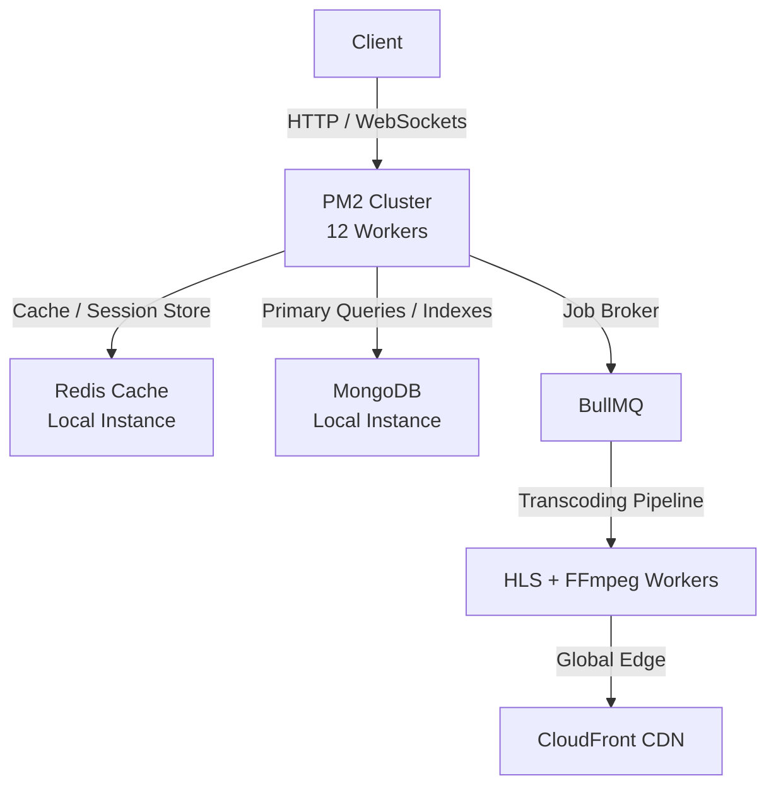

# 🌌 MediaVerse

<div align="center">

**A production-grade YouTube + Twitter hybrid platform built to demonstrate full-stack systems engineering.**

[](https://nodejs.org/)
[](https://expressjs.com/)
[](https://www.mongodb.com/)
[](https://redis.io/)
[](https://aws.amazon.com/s3/)
[](https://socket.io/)
[](https://react.dev/)
[](https://vite.dev/)
[](https://docker.com/)

[Live Demo](#) · [API Docs](http://localhost:8000/api-docs) · [Architecture](#-architecture)

</div>

---

## 📖 What is MediaVerse?

MediaVerse is a dual-platform entertainment ecosystem that unifies two distinct products under one codebase:

- **MediaVerse Video** — A YouTube-grade video platform with async HLS transcoding, adaptive bitrate streaming, subscriptions, playlists, and a full creator analytics dashboard.
- **MediaVerse X** — A Twitter/X-style microblogging feed with threaded replies, retweets, quote tweets, hashtag trending, and real-time notifications.

Both platforms share a single backend, a single authentication system, and a unified real-time infrastructure — but present completely separate frontends with distinct color systems, layouts, and UX patterns.

---

## 🏛️ Architecture


### System Overview

```
┌─────────────────────────────────────────────────────────────────────┐
│                        Client Layer                                  │
│         React 19 + Vite (YouTube UI) ←→ (Twitter UI)               │
│         Socket.IO Client (real-time notifications, live feed)       │
└──────────────────────┬──────────────────────────────────────────────┘
                       │ HTTP / WebSocket
┌──────────────────────▼──────────────────────────────────────────────┐
│                   Security & Ingress                                 │
│    Nginx / Express Trust Proxy → Redis Rate Limiter                 │
│    Helmet Headers → HPP → JWT Cookie Validation                     │
└──────────────────────┬──────────────────────────────────────────────┘
                       │ Authorized Request
┌──────────────────────▼──────────────────────────────────────────────┐
│               Application Layer (Node.js / Express 5)               │
│                                                                      │
│  REST API ──────────────────────────────► MongoDB Atlas             │
│      │                                   (primary data store)       │
│      │                                                              │
│      ├──► Typesense Search Engine        (full-text + autocomplete) │
│      │                                                              │
│      ├──► Redis Cache                    (view dedup, sessions)     │
│      │                                                              │
│      ├──► BullMQ Queue ──────────────► Video Processing Worker     │
│      │         │                              │                     │
│      │         │                    FFmpeg transcode → HLS          │
│      │         │                    Upload → S3 Processed Bucket    │
│      │         │                    Notify → MongoDB (status=ready) │
│      │         └──► Dead Letter Queue   (failed jobs)              │
│      │                                                              │
│  Socket.IO Server ──► Redis Pub/Sub     (horizontal scaling)        │
│      │                                                              │
│      └──────────────────────────────────► Sentry (error tracking)  │
└──────────────────────────────────────────────────────────────────────┘
                       │
┌──────────────────────▼──────────────────────────────────────────────┐
│                      Storage Layer                                   │
│                                                                      │
│  S3 Raw Uploads    S3 HLS Streams    S3 Thumbnails    Cloudinary    │
│  (landing zone)    (transcoded)      (frame images)   (avatars)     │
│                         │                                           │
│                    CloudFront CDN  ←─────────── HLS Player         │
│                    (global delivery)             (HLS.js)           │
└──────────────────────────────────────────────────────────────────────┘
```

### Video Processing Pipeline

```
User selects file
      │
      ▼
POST /api/v1/upload/request-url
      │  Returns pre-signed S3 PUT URL (5 min expiry)
      ▼
Browser PUTs file directly to S3 Raw Bucket
      │  (bypasses Node server — no memory pressure)
      ▼
POST /api/v1/upload/confirm/:videoId
      │
      ▼
BullMQ enqueues job → Redis broker
      │
      ▼
FFmpeg Worker (separate process, concurrency: 2)
      ├── ffprobe: extract metadata (codec, fps, resolution, duration)
      ├── Transcode: 360p / 480p / 720p / 1080p (skip if source < target)
      ├── HLS segmentation: .m3u8 master manifest + .ts chunks per resolution
      ├── Thumbnail generation: 3 frames at 25% / 50% / 75% of duration
      └── Upload all assets → S3 Processed Bucket → CloudFront CDN
            │
            ▼
      MongoDB: video.processingStatus = "ready"
      Socket.IO: emit "video_ready" notification to uploader
      Typesense: index video for search
```

### Real-Time Event Flow

```
User action (like, comment, tweet, reply)
      │
      ▼
Express API → save to MongoDB
      │
      ▼
Socket.IO Server → Redis Pub/Sub
      │              (broadcasts across all Node instances)
      ▼
All connected clients in the relevant room receive the event
      │
      ├── Video room:   new_comment, viewer_count_update, user_typing
      ├── Tweet room:   new_reply, new_quote_tweet
      └── User direct:  new_subscriber, new_like, video_ready, mention
```

---

## ✨ Feature Set

### Video Platform (MediaVerse Video)
- **Async video pipeline** — Upload → S3 → BullMQ → FFmpeg → HLS → CloudFront
- **Adaptive bitrate streaming** — HLS.js player auto-selects quality based on network
- **Multi-resolution transcoding** — 360p / 480p / 720p / 1080p with per-resolution manifests
- **Auto-generated thumbnails** — 3 frames extracted per video at upload time
- **Creator analytics dashboard** — Views over time, subscriber growth, audience retention, traffic sources, top videos (powered by MongoDB aggregation pipelines)
- **Subscriptions & playlists** — Full social graph for the video side
- **Like toggle with deduplication** — Polymorphic likes (video, comment, tweet) via shared model
- **Watch history** — Per-user, sorted by recency, powers personalized feed

### Twitter Platform (MediaVerse X)
- **Tweet feed algorithm** — Engagement-weighted scoring (views × 0.1 + likes × 5 + retweets × 3 + replies × 2 + recency × 20)
- **Threaded replies** — Full parent/child tweet chains with `parentTweet` self-referential model
- **Retweets + quote tweets** — Toggle-based retweet with atomic counter sync
- **Hashtag system** — Auto-extracted on pre-save hook, drives trending and search
- **@mention notifications** — Extracted on save, real-time delivery via Socket.IO
- **Media tweets** — Up to 4 images per tweet via S3 pre-signed URL flow
- **Trending hashtags** — 7-day rolling window aggregation by tweet volume

### Shared Infrastructure
- **Full-text search** — Typesense with fuzzy matching, typo tolerance, autocomplete, search history
- **Recommendation engine** — Content-based (tag overlap) + collaborative filtering (co-watch) hybrid
- **Real-time notifications** — Socket.IO with JWT auth on handshake, Redis Pub/Sub adapter for horizontal scaling
- **View deduplication** — Redis key `view:{videoId}:user:{userId}` with 24h TTL
- **Rate limiting** — General (100/15min), auth (10/15min), upload (20/hr), analytics (30/min)
- **Structured logging** — Pino with pino-http, JSON in production, pino-pretty in development
- **API documentation** — Swagger/OpenAPI at `/api-docs`
- **Error tracking** — Sentry integration (optional, env-gated)

---

## 🛠️ Tech Stack

| Layer | Technology | Why |
|-------|-----------|-----|
| Runtime | Node.js 20 + Express 5 | Native promise support, async error handling |
| Database | MongoDB 7 + Mongoose 8 | Flexible schema, powerful aggregation pipelines |
| Queue | BullMQ + Redis | Reliable async jobs, retry logic, worker isolation |
| Cache | Redis (ioredis) | View dedup, rate limiting, Socket.IO adapter |
| Storage | AWS S3 (2 buckets) + CloudFront | Scalable object storage + global CDN |
| Video | FFmpeg + HLS.js | Industry-standard transcoding + adaptive streaming |
| Search | Typesense | Fast, typo-tolerant, self-hostable, free tier available |
| Real-time | Socket.IO + Redis Pub/Sub | Horizontally scalable WebSocket pub/sub |
| Validation | Zod | Type-safe runtime schema validation with `.refine()` |
| Logging | Pino + pino-http | Fastest structured JSON logger for Node.js |
| API Docs | Swagger / OpenAPI | Auto-generated from JSDoc annotations |
| Testing | Jest + Supertest | API integration tests |
| Security | Helmet + HPP + bcrypt | Security headers, parameter pollution protection |
| CI/CD | GitHub Actions | Lint → Test → Docker build pipeline |
| Containers | Docker + Docker Compose | 4-service prod, 6-service dev (with MinIO + Typesense) |
| Frontend | React 19 + Vite 7 + Tailwind CSS 3.4 | Fast builds, utility-first dark theme |
| Animations | Framer Motion | Page transitions, like animations, sidebar expand |
| Charts | Recharts | Analytics dashboard visualizations |
| 3D | Three.js / React Three Fiber | Landing page hero |

---

## 🔑 Key Engineering Decisions

### Why BullMQ instead of processing videos inline?

Video transcoding takes 1–5 minutes per video. Handling this in the HTTP request/response cycle would timeout at 30 seconds and block the Node.js event loop for other requests. BullMQ decouples upload from processing — the user gets an immediate response, and the worker transcodes asynchronously with configurable retry logic (3 attempts, exponential backoff). The worker runs as a completely separate process, meaning it can be scaled independently of the API server.

### Why Typesense instead of MongoDB Atlas Search?

MongoDB Atlas Search requires an M10+ dedicated cluster ($57+/month). This project uses a free M0 cluster. Typesense is open-source, self-hostable via Docker (one command, zero cost), and provides comparable fuzzy search with better autocomplete support via `prefix: true` matching. It also exposes a clean REST API that syncs from MongoDB via fire-and-forget hooks — no change stream setup required.

### Why MongoDB instead of PostgreSQL?

MediaVerse has a highly social graph with polymorphic relationships (likes on videos, tweets, and comments share one model), self-referential tweet threads, and analytics data that grows at a write-heavy rate. MongoDB's aggregation pipeline made building the recommendation engine and analytics service significantly faster than designing normalized SQL schemas. The `$lookup`, `$unwind`, and `$setIntersection` operators map directly to the collaborative filtering and tag-overlap algorithms. For a portfolio project demonstrating backend systems depth, complex aggregation pipelines are more impressive than ORM-generated JOIN queries.

### Why pre-signed S3 URLs for video upload?

Direct multipart upload to the Node server would consume ~500MB of server RAM per concurrent upload and require large request timeout values. Pre-signed URLs let the browser PUT the file directly to S3 — the Node server only issues a 5-minute signed URL and then handles the lightweight job queue trigger. This is exactly how YouTube, Vimeo, and Cloudinary handle uploads at scale.

### Why Socket.IO with Redis Pub/Sub adapter?

Without the Redis adapter, Socket.IO only delivers events to clients connected to the same Node process. When the API server runs across multiple instances (or even just API + worker), events emitted in one process are invisible to clients connected to another. The Redis Pub/Sub adapter broadcasts events across all instances, making real-time delivery work correctly regardless of which server instance the emitting controller runs on.

---

## 📂 Project Structure

```
mediaverse/
├── src/
│   ├── app.js                    # Express setup, middleware stack, route mounts
│   ├── index.js                  # Entry point: DB, Typesense, Socket.IO, server
│   ├── constants.js              # DB name, shared constants
│   ├── config/
│   │   ├── db.js                 # Mongoose connection
│   │   ├── redis.js              # ioredis singleton
│   │   ├── socket.js             # Socket.IO server + JWT auth + room handlers
│   │   ├── typesense.js          # Typesense client
│   │   ├── typesenseCollections.js  # Schema bootstrap + schema change detection
│   │   └── swagger.js            # OpenAPI spec
│   ├── controllers/              # 14 controllers (user, video, tweet, comment, ...)
│   ├── services/                 # 9 services (search, recommendation, analytics, ...)
│   ├── models/                   # 10 Mongoose schemas with indexes
│   ├── routes/                   # 14 route files
│   ├── middlewares/              # verifyJWT, optionalAuth, validate, rateLimiter, ...
│   ├── validators/               # Zod schemas (6 files)
│   ├── utils/                    # ApiError, ApiResponse, asyncHandler, s3, logger
│   ├── queues/                   # BullMQ queue definitions
│   ├── workers/                  # videoProcessor.js + index.js entry
│   └── tests/                   # Jest + Supertest test suite
├── frontend/
│   └── src/
│       ├── layouts/              # YouTubeLayout.jsx, TwitterLayout.jsx
│       ├── components/           # Videos/, Tweets/, Dashboard/, UserPage/, Search/
│       ├── hooks/                # useSocket.js
│       ├── utils/                # formatDuration.js, formatTimeAgo.js
│       └── constants/            # chartColors.js
├── scripts/
│   └── bulkIndexTypesense.js     # One-time Typesense re-index script
├── docker-compose.yml            # Production: API, Worker, MongoDB, Redis
├── docker-compose.dev.yml        # Dev: + MinIO (S3-compatible), Typesense
├── Dockerfile
└── .github/workflows/ci.yml      # Lint → Test → Docker build
```

---

## 🚀 Local Setup

### Prerequisites
- Docker Desktop (recommended — handles all services)
- Node.js 20+ (for running without Docker)
- FFmpeg (required for the video worker — `ffmpeg -version` to verify)

### Option A — Docker (Recommended)

```bash
# 1. Clone the repo
git clone https://github.com/JaiminM06/mediaverse.git
cd mediaverse

# 2. Copy and fill in environment variables
cp .env.example .env
# Edit .env with your AWS credentials, MongoDB URI, JWT secrets

# 3. Start everything (MongoDB, Redis, Typesense, MinIO, API, Worker)
npm run docker:dev

# 4. Start the frontend
cd frontend
npm install
npm run dev
```

Open `http://localhost:5173`

### Option B — Manual

```bash
# Terminal 1 — Backend API
npm install
npm run dev

# Terminal 2 — Video Processing Worker
npm run worker

# Terminal 3 — Frontend
cd frontend
npm install
npm run dev
```

### One-Time: Index existing data into Typesense

```bash
node scripts/bulkIndexTypesense.js
```

Run this once after first setup if you have existing MongoDB data that needs to appear in search results.


---

## ⚡ Performance Engineering

### 🏗️ Performance Architecture Flow


### 🔐 1. Authentication API Optimization
#### The Performance Journey & Profile
*   **Baseline Measurement**: Initial stress tests of the login and registration endpoints under concurrency revealed an average response time of **~2.5 seconds** per request.
*   **Bottleneck Profiling & Timing**: 
    *   Using `k6`, we profiled the auth controllers and noticed high CPU execution times.
    *   Adding microsecond timing middleware revealed that the latency was concentrated inside the password hashing validation and redundant database lookups.
    *   Specifically, the JWT session verification was executing duplicate MongoDB queries to fetch the full user profile on every route access.
*   **Remediation & Refactoring**:
    *   Refactored the middleware stack to fetch and serialize only the required user ID, eliminating duplicate user model calls.
    *   Migrated the test environment from a remote MongoDB Atlas (which suffered from network round-trip overhead of 70-120ms per query) to a local MongoDB instance.
    *   Migrated the caching store from Upstash Redis (HTTP-based cloud Redis) to a local high-performance Redis Docker container, eliminating network serialization overhead.
    *   Tuned the MongoDB connection pool (increased pool size to 100) to avoid socket starvation.
    *   Implemented persistent access token validation cached directly in Redis to avoid hitting MongoDB for session state.
    *   Launched a PM2 cluster (with 12 worker processes) to maximize CPU core utility.
*   **Results**: Latency dropped from **2.5s down to 48 ms** under peak load with **0% error rate** (P95: 155.15 ms) at a throughput of **534.6 requests/second**.

---

### 📰 2. Personalized Feed Optimization
#### The Performance Journey & Profile
*   **Baseline & Aggregation Bottlenecks**: The personalized feed initially loaded all published videos in memory, performed high-cardinality array intersection checks (`$setIntersection` in MongoDB aggregations), and sorted them dynamically. This triggered blocking in-memory sorts that degraded latency exponentially as database size grew.
*   **Scalable Candidate Retrieval Design**:
    *   We replaced the in-memory array filtering with a **2-stage candidate-retrieval pipeline**:
        *   **Stage 1 (Indexed Candidate Fetch)**: Retrieve the top 300 candidate videos matching the user's watch history tags directly using a compound B-tree index:
            `Video.index({ isPublished: 1, tags: 1, views: -1 })`
        *   **Stage 2 (Lightweight Re-Ranking)**: Score the 300 candidates in Node.js using weighted tag overlaps, video age decay (freshness), and log-based view counts (popularity) without any machine learning overhead.
*   **Query & Index Refinements**:
    *   Postponed the expensive MongoDB `.populate("owner")` call so it executes **only on the final 20 sliced recommendation results** instead of all 300 candidates, reducing join operations by 93%.
    *   Configured all database reads to use `.lean()` to fetch raw POJOs instead of full Mongoose documents.
    *   Added a Redis caching layer with a 15-second cache TTL for personalized feeds.
    *   Validated query execution plans using MongoDB `EXPLAIN` to ensure queries perform prefix index scans and avoid collection scans (`COLLSCAN`) or in-memory sorting.

---

### 🏋️ 3. Stress Testing Methodology
*   **Why k6?**: We selected Grafana `k6` for its high-performance JavaScript-based execution, lightweight CPU/RAM footprint, and native support for setting sub-millisecond HTTP thresholds and custom virtual user (VU) distributions.
*   **Why PM2 Cluster?**: Node.js runs as a single-threaded event loop. Running under a PM2 cluster with 12 workers allowed us to scale across all available CPU cores, sharing the network port and handling high concurrent requests without thread starvation.
*   **Load Testing vs. Stress Testing**:
    *   *Load Testing*: Evaluates how the system handles a normal, expected amount of traffic over a sustained duration (e.g. 100 VUs).
    *   *Stress Testing*: Pushes the system beyond its expected normal capacity (up to 750 VUs) to find the breaking point, test error recovery, and measure peak resource saturation.
*   **Capacity Testing & Sustainable Operating Range**: 
    *   Using a ramping-up VU profile, we determined that the system operates in a highly sustainable range at **750 concurrent users** and **~535 requests/second** with **0% failure rate**.

---

### 📊 Final Performance Metrics

| Metric | Authentication API | Personalized Video Feed |
| :--- | :--- | :--- |
| **Throughput** | **534.6 req/sec** | **~535 req/sec** |
| **Average Latency** | **48 ms** | **154 ms** |
| **P95 Latency** | **155.15 ms** | **470.65 ms** |
| **Request Error Rate** | **0%** | **0%** |
| **Test Concurrency** | **750 VUs** | **750 VUs** |
| **Database Profiling** | Indexed key lookups | MongoDB `EXPLAIN` validated |

---

### 💡 Lessons Learned
1.  **Identify Bottlenecks First**: Always instrument before optimizing. Timing middleware and k6 profiling showed that password hashing and external database round-trips were the primary causes of latency, not Express itself.
2.  **Database Schema & Index Alignment**: Designing compound indexes around the *Equality, Sort, Range* rule prevents MongoDB from executing expensive in-memory sorts. Postponed document joins (`populate`) until after sorting saves massive DB disk read cycles.
3.  **Caching & Eviction**: Short TTL caches (e.g. 15s) in memory/Redis are highly effective for high-frequency polling endpoints, preventing database read replication lag under surge events.
4.  **Capacity Planning**: Systems scalability requires removing single points of failure. Moving long-running tasks like video transcoding into BullMQ workers keeps the core API fast and responsive.

---

## ⚙️ Environment Variables

### Backend (`.env` in project root)

| Variable | Required | Description |
|----------|----------|-------------|
| `PORT` | No (default 8000) | API server port |
| `MONGODB_URI` | ✅ | MongoDB connection string |
| `ACCESS_TOKEN_SECRET` | ✅ | JWT signing secret for access tokens (min 32 chars) |
| `REFRESH_TOKEN_SECRET` | ✅ | JWT signing secret for refresh tokens (min 32 chars) |
| `ACCESS_TOKEN_EXPIRY` | No (default 1d) | Access token expiry |
| `REFRESH_TOKEN_EXPIRY` | No (default 10d) | Refresh token expiry |
| `REDIS_URL` | ✅ | Redis connection URL |
| `AWS_ACCESS_KEY_ID` | ✅ | AWS credentials |
| `AWS_SECRET_ACCESS_KEY` | ✅ | AWS credentials |
| `AWS_REGION` | ✅ | S3 bucket region (e.g. `ap-south-1`) |
| `AWS_S3_RAW_BUCKET` | ✅ | Bucket for raw video uploads |
| `AWS_S3_PROCESSED_BUCKET` | ✅ | Bucket for HLS output + thumbnails |
| `CLOUDFRONT_DOMAIN` | ✅ | CloudFront distribution domain (no https://) |
| `TYPESENSE_HOST` | ✅ | Typesense server host |
| `TYPESENSE_PORT` | ✅ | Typesense server port (default 8108) |
| `TYPESENSE_API_KEY` | ✅ | Typesense API key |
| `TYPESENSE_PROTOCOL` | No (default http) | `http` or `https` |
| `CLOUDINARY_CLOUD_NAME` | ✅ | Cloudinary (avatars, cover images) |
| `CLOUDINARY_API_KEY` | ✅ | Cloudinary |
| `CLOUDINARY_API_SECRET` | ✅ | Cloudinary |
| `SENTRY_DSN` | No | Sentry error tracking DSN (free tier available) |
| `LOG_LEVEL` | No (default info) | Pino log level (`debug`/`info`/`warn`/`error`) |
| `NODE_ENV` | No (default development) | `development` or `production` |

---

## 🧪 Testing

```bash
# Run all tests
npm test

# With coverage report
npm run test:coverage

# Watch mode
npm run test:watch
```

Tests use Jest + Supertest. The test suite covers:
- Input validation (Zod schemas, edge cases)
- Rate limiting (429 responses)
- Auth middleware (401 on missing/invalid tokens)
- Health endpoint
- Public vs protected route access

```bash
# Check API documentation
open http://localhost:8000/api-docs

# Check server health
curl http://localhost:8000/health
```

---

## 🐳 Docker

```bash
# Development (with MinIO + Typesense + hot reload)
npm run docker:dev

# Production
npm run docker:prod

# Tear down
npm run docker:down
```

Services in `docker-compose.dev.yml`:
- `api` — Express API server (port 8000)
- `worker` — BullMQ video processing worker
- `mongo` — MongoDB 7 (port 27017)
- `redis` — Redis 7 Alpine (port 6379)
- `minio` — MinIO S3-compatible storage (ports 9000, 9001)
- `typesense` — Typesense 0.25.2 (port 8108)

---

## 📡 API Reference

Full interactive documentation available at `http://localhost:8000/api-docs` (Swagger UI).

### Key Endpoints

| Method | Endpoint | Auth | Description |
|--------|----------|------|-------------|
| `POST` | `/api/v1/users/register` | — | Register new user |
| `POST` | `/api/v1/users/login` | — | Login, returns JWT cookies |
| `POST` | `/api/v1/upload/request-url` | ✅ | Get pre-signed S3 upload URL |
| `POST` | `/api/v1/upload/confirm/:videoId` | ✅ | Trigger video processing |
| `GET` | `/api/v1/upload/status/:videoId` | ✅ | Poll processing status |
| `GET` | `/api/v1/stream/:videoId` | — | Get HLS manifest URL |
| `GET` | `/api/v1/tweets/feed` | Optional | Personalized or global tweet feed |
| `POST` | `/api/v1/tweets/:id/retweet` | ✅ | Toggle retweet |
| `POST` | `/api/v1/tweets/:id/reply` | ✅ | Reply to a tweet |
| `GET` | `/api/v1/search?q=...&type=video\|tweet\|all` | Optional | Full-text search |
| `GET` | `/api/v1/search/autocomplete?q=...` | — | Autocomplete suggestions |
| `GET` | `/api/v1/analytics/summary` | ✅ | Creator dashboard summary |
| `GET` | `/api/v1/trending/videos?period=week` | — | Trending videos |
| `GET` | `/api/v1/trending/hashtags` | — | Trending hashtags |
| `GET` | `/api/v1/recommendations/:videoId` | — | Related video recommendations |

---

## 🔄 Socket.IO Events

| Event | Direction | Room | Payload |
|-------|-----------|------|---------|
| `register` | Client → Server | — | `{ userId }` |
| `join_video_room` | Client → Server | — | `{ videoId }` |
| `leave_video_room` | Client → Server | — | `{ videoId }` |
| `join_tweet_room` | Client → Server | — | `{ tweetId }` |
| `typing_comment` | Client → Server | — | `{ videoId, username }` |
| `viewer_count_update` | Server → Room | `video-{id}` | `{ videoId, count }` |
| `new_comment` | Server → Room | `video-{id}` | `{ comment }` |
| `new_reply` | Server → Room | `tweet-{id}` | `{ reply }` |
| `new_tweet` | Server → All | — | `{ tweet }` |
| `notification` | Server → User | direct | `{ notification }` |

---

## 📊 Data Models

```
User ──────────────── Video ─────── Comment ── Like
  │                     │               │        │
  │ subscribes to       │ owned by      │        │ polymorphic
  │                     │               │        │ (video/tweet/comment)
Subscription          WatchHistory  VideoAnalytics
                         │
Tweet ─── parentTweet (self-ref, threads)
  │   └── originalTweet (retweets)
  │   └── quoteTweet    (quote tweets)
  │
  ├── hashtags[]    (auto-extracted, pre-save hook)
  └── mentions[]    (auto-resolved to ObjectIds, pre-save hook)

Notification ── recipient (User) ── sender (User)
             └── referenceId (Video | Tweet | Comment)
```

---

## 🙋 About This Project

MediaVerse was built as a portfolio project to demonstrate production-grade backend systems engineering across the following areas:

- **Async distributed systems** — BullMQ job queues with retry logic and failure notifications
- **Real-time architecture** — Socket.IO with Redis Pub/Sub for horizontal scaling
- **Video infrastructure** — FFmpeg HLS transcoding pipeline with multi-bitrate output
- **Search engineering** — Typesense full-text search with fuzzy matching and autocomplete
- **Data modelling** — MongoDB aggregation pipelines for recommendations, analytics, and feed algorithms
- **Security** — JWT dual-token rotation, httpOnly cookies, Zod validation, rate limiting, helmet
- **Observability** — Pino structured logging, Sentry error tracking, Swagger API docs
- **DevOps** — Docker multi-service orchestration, GitHub Actions CI/CD

---

## 📄 License

MIT © 2026