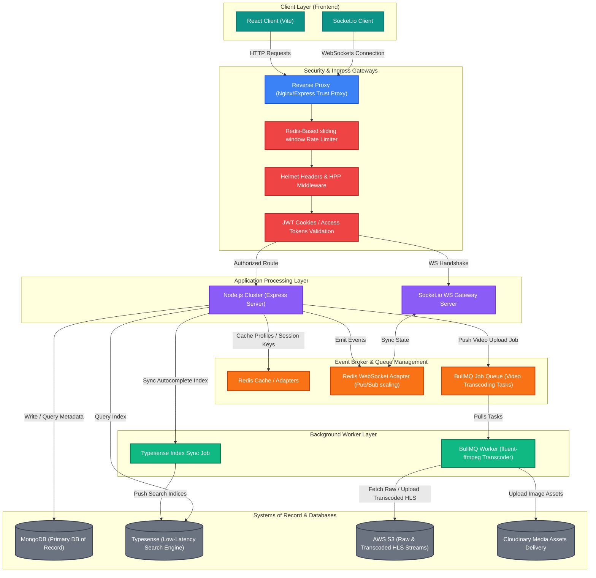

# 🌌 MediaVerse (Unified Video & Social Architecture)

[](https://vite.dev/)
[](https://react.dev/)
[](https://nodejs.org/)
[](https://expressjs.com/)
[](https://www.mongodb.com/)
[](https://redis.io/)
[](https://aws.amazon.com/s3/)
[](https://socket.io/)

MediaVerse is a high-performance, dual-platform entertainment ecosystem that unifies a YouTube-grade video hosting and streaming service with a Twitter/X-style real-time microblogging feed. The architecture is engineered to support adaptive HLS video transcoding, low-latency search indices, real-time message routing, rate limiting, and robust error tracking.

---

## 🏛️ Comprehensive Architecture Diagram

Below is the system architecture of MediaVerse, representing the flow of client requests, background jobs, database synchronization, caching layers, and storage gateways.



---

## 🔄 Core Request Lifecycles & Flows

### 1. Video Processing & Transcoding Pipeline (HLS stream creation)
When a creator uploads a video, MediaVerse processes the video asynchronously to support dynamic bitrate streaming:

```mermaid
gantt
    title Video Transcoding Workflow (BullMQ + FFMPEG)
    dateFormat  X
    axisFormat %s sec
    
    section API Route
    Client Upload Request     :active, 0, 3
    S3 Upload Presign Creation : 3, 5
    Client Direct Upload to S3 : 5, 12
    Trigger Transcode Queue   :crit, 12, 14
    
    section BullMQ Queue
    Job Enqueued (Wait State) : 14, 17
    Worker Pulls Task         : 17, 18
    
    section FFMPEG Worker
    Download Raw Source       : 18, 22
    Create HLS Manifest (.m3u8): 22, 28
    Create TS Segments (.ts)  : 28, 38
    Upload Output Streams     : 38, 43
    Update DB Status (Ready)  : 43, 45
```



### 2. WebSocket Real-Time Event Dispatch System
Live interactions (tweets, replies, views, likes) travel through a distributed network synced via Redis:

```mermaid
sequenceDiagram
    autonumber
    actor Alice as Client A
    actor Bob as Client B
    participant App as Express Gateway
    participant Redis as Redis Pub/Sub Adapter
    participant DB as MongoDB
    
    Alice->>App: Action (e.g. Like Video / Post Reply)
    rect rgb(30, 41, 59)
        note right of App: Process inside Node Cluster
        App->>DB: Mutate & Save Event
        DB-->>App: Confirm Write
    end
    App->>Redis: Publish Event (Channel: mediaverse_events)
    rect rgb(17, 24, 39)
        note over Redis: Distribute to all scaling clusters
        Redis-->>App: Broadcast to Room "video_123"
    end
    App-->>Bob: Emit socket event "new_like" / "new_reply"
```



---

## ⚡ Technical Features & Design Choices

*   **Dual Platforms**: Seamless transitions between MediaVerse Video (YouTube style, red accents) and MediaVerse X (Twitter style, blue accents) on a single session.
*   **HLS Streaming**: Auto-segmentation of uploaded videos into adaptive HLS playlists (`.m3u8` and `.ts`) via background workers.
*   **Low-Latency Search**: Autocomplete search indices synchronized with MongoDB documents and powered by Typesense.
*   **Redis Middleware**: Dual-purpose Redis engine:
    *   **Rate Limiting**: Sliding window rate limits that persist across proxy routing to prevent auth abuse lockouts.
    *   **Adapter Scaling**: Redis adapter for Socket.io enabling scaling across multiple Node.js instances.
*   **Security Architecture**: Cross-Origin Resource Sharing (CORS) configured with credentials support, Helmet header enforcement, and HPP parameter cleansing.
*   **Telemetry**: Sentry error boundaries integrated inside backend routes and job workers to log exceptions automatically.

---

## 📂 Repository Directory Layout

```
.
├── src/
│   ├── app.js               # Express application initialization & middleware config
│   ├── index.js             # API entrypoint, MongoDB connection, & server bind
│   ├── config/              # Redis, Typesense, Sentry, & DB config files
│   ├── controllers/         # Request handling logic (Users, Videos, Tweets, Likes, etc.)
│   ├── middlewares/         # Auth guards, Rate limiters, Error wrappers, Uploads
│   ├── models/              # Mongoose DB Schemas with indexes
│   ├── routes/              # HTTP Route declarations
│   ├── socket/              # Socket.io gateways & room managers
│   └── workers/             # Transcoder & index sync background workers (BullMQ)
├── frontend/
│   ├── src/
│   │   ├── components/      # UI components (Landing Page, YouTube Feed, Twitter Feed)
│   │   ├── layouts/         # Layout shells (YouTubeLayout, TwitterLayout)
│   │   └── main.jsx         # React application shell & Axios response interceptor
│   └── package.json         # React dependencies (Framer Motion, React Three Fiber, Recharts)
├── docker-compose.yml       # Production-ready services orchestrator
└── package.json             # Backend dependencies
```

---

## 🚀 Local Installation & Running

### Prerequisites
*   Node.js (v18+)
*   MongoDB Instance
*   Redis Cluster
*   Typesense (optional for local mock search)

### Step 1: Clone and Configure Environments
Create a `.env` file at the root:
```env
PORT=8000
MONGODB_URI=mongodb://127.0.0.1:27017/mediaverse
ACCESS_TOKEN_SECRET=your_access_token_secret
REFRESH_TOKEN_SECRET=your_refresh_token_secret
ACCESS_TOKEN_EXPIRY=1d
REFRESH_TOKEN_EXPIRY=10d

REDIS_HOST=127.0.0.1
REDIS_PORT=6379

AWS_ACCESS_KEY_ID=your_aws_key
AWS_SECRET_ACCESS_KEY=your_aws_secret
AWS_REGION=us-east-1
S3_BUCKET_NAME=your_bucket_name
```

### Step 2: Spin Up Environment Containers
If you have Docker installed, spin up all backing storage engines instantly:
```bash
npm run docker:dev
```

### Step 3: Run the Services
Run the Express backend API and background transcoding workers concurrently:
```bash
# Install root backend packages
npm install

# Run Express + Workers
npm run dev:all
```

Run the React frontend client in a separate terminal:
```bash
cd frontend
npm install
npm run dev
```
Open `http://localhost:5173` to explore your unified media universe.
